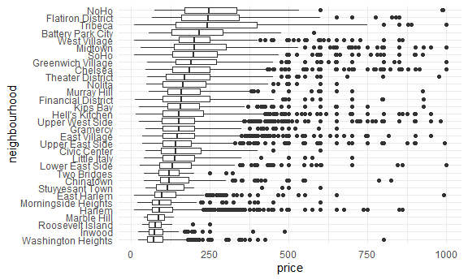
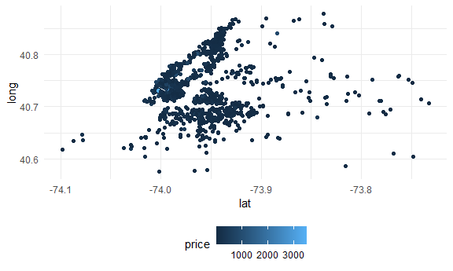

Case study
================

## Load the airbnb data

``` r
data("nyc_airbnb")
```

## Brainstorm some questions

*What is the best Airbnb in Staten Island for \< 100? *What price range
is popular in each borough? most rented? *What apartment features are
related to price? *Cheapest room type in each neighborhood? \*Hosts have
higher ratings?

## Answer some questions

data cleaning

``` r
nyc_airbnb = 
  nyc_airbnb %>% 
  mutate(stars = review_scores_location/2)
```

``` r
nyc_airbnb %>%
  count(neighbourhood_group, room_type) %>%
  pivot_wider(
    names_from = room_type, 
    values_from = n
  )
```

    ## # A tibble: 5 x 4
    ##   neighbourhood_group `Entire home/apt` `Private room` `Shared room`
    ##   <chr>                           <int>          <int>         <int>
    ## 1 Bronx                             192            429            28
    ## 2 Brooklyn                         7427           9000           383
    ## 3 Manhattan                       10814           7812           586
    ## 4 Queens                           1388           2241           192
    ## 5 Staten Island                     116            144             1

``` r
nyc_airbnb %>%
  group_by(neighbourhood_group, room_type) %>%
  summarize(mean_price = mean(price))
```

    ## `summarise()` regrouping output by 'neighbourhood_group' (override with `.groups` argument)

    ## # A tibble: 15 x 3
    ## # Groups:   neighbourhood_group [5]
    ##    neighbourhood_group room_type       mean_price
    ##    <chr>               <chr>                <dbl>
    ##  1 Bronx               Entire home/apt      125. 
    ##  2 Bronx               Private room          65.5
    ##  3 Bronx               Shared room           57.5
    ##  4 Brooklyn            Entire home/apt      175. 
    ##  5 Brooklyn            Private room          76.7
    ##  6 Brooklyn            Shared room           59.6
    ##  7 Manhattan           Entire home/apt      238. 
    ##  8 Manhattan           Private room         107. 
    ##  9 Manhattan           Shared room           84.7
    ## 10 Queens              Entire home/apt      140. 
    ## 11 Queens              Private room          70.6
    ## 12 Queens              Shared room           49.1
    ## 13 Staten Island       Entire home/apt      207. 
    ## 14 Staten Island       Private room          65.4
    ## 15 Staten Island       Shared room           25

``` r
nyc_airbnb %>%
  filter(neighbourhood_group == "Manhattan") %>%
  count(neighbourhood)
```

    ## # A tibble: 32 x 2
    ##    neighbourhood          n
    ##    <chr>              <int>
    ##  1 Battery Park City     65
    ##  2 Chelsea             1072
    ##  3 Chinatown            360
    ##  4 Civic Center          42
    ##  5 East Harlem         1048
    ##  6 East Village        1858
    ##  7 Financial District   391
    ##  8 Flatiron District     90
    ##  9 Gramercy             307
    ## 10 Greenwich Village    383
    ## # ... with 22 more rows

``` r
nyc_airbnb %>%
  filter(price < 1000, 
         neighbourhood_group == "Manhattan") %>%
  mutate(neighbourhood = fct_reorder(neighbourhood, price)) %>%
  ggplot(aes(x= neighbourhood, y = price)) + 
  geom_boxplot() +
  coord_flip()
```



``` r
nyc_airbnb %>% 
  sample_n(1000) %>%
  ggplot(aes(x = lat, y = long, color = price)) + 
  geom_point()
```



## Create a leaflet map

``` r
nyc_airbnb %>%
  sample_n(100) %>% 
  leaflet() %>%
  addProviderTiles(providers$CartoDB.Positron) %>%
  addCircleMarkers(~lat, ~long, radius = 1)
```

<!--html_preserve-->

<div id="htmlwidget-4f2324977bc78c39cb57" class="leaflet html-widget" style="width:90%;height:345.6px;">

</div>

<script type="application/json" data-for="htmlwidget-4f2324977bc78c39cb57">{"x":{"options":{"crs":{"crsClass":"L.CRS.EPSG3857","code":null,"proj4def":null,"projectedBounds":null,"options":{}}},"calls":[{"method":"addProviderTiles","args":["CartoDB.Positron",null,null,{"errorTileUrl":"","noWrap":false,"detectRetina":false}]},{"method":"addCircleMarkers","args":[[40.782290054683,40.6723783336596,40.7175457989104,40.7444916983695,40.6361388315904,40.7974664253478,40.7466814529245,40.7484169390736,40.6907839313617,40.6932811491845,40.7327146284872,40.7040451054572,40.7241469953939,40.7779938572252,40.6732368180975,40.7487481649281,40.6770244934156,40.8122137961593,40.6349225783346,40.7339742322739,40.8455775022745,40.6925093852126,40.6833690252517,40.6948635078576,40.6834985993572,40.7143122914495,40.7785474941169,40.7780460717985,40.7208197988891,40.7719444951973,40.7282819523443,40.700173326659,40.7164839167728,40.7296264608245,40.7974676857869,40.692863876302,40.7138040646521,40.7327792687774,40.6770878573491,40.6908176434508,40.6728257566386,40.6782753935278,40.7587936934346,40.7448107243416,40.811696122201,40.7795399747467,40.7314606073345,40.7186575209344,40.6638293435605,40.6941804076755,40.7257736102663,40.7722267873902,40.7111895659929,40.7167652705859,40.6904041983565,40.8553492454733,40.715060331205,40.6729304432448,40.7423623804059,40.776360690691,40.7152617501066,40.726244429555,40.8014246628399,40.7604979183736,40.6258064637415,40.7628414925546,40.6838235067512,40.7269150526758,40.7479374506064,40.6837002075244,40.6615939629423,40.7257683235399,40.6572688866047,40.6892294292751,40.7651727737946,40.6790319341726,40.6280821446618,40.7456029948089,40.7038660530769,40.7343698798806,40.7207497713562,40.6746371740214,40.788284367073,40.8208672189097,40.6998455937846,40.7881281280001,40.7573536022742,40.6893234447964,40.6586728153294,40.8288245618695,40.761077624034,40.7257611931075,40.7838863207991,40.6841030988089,40.7478922744189,40.8105610413522,40.6564546266025,40.7145330856748,40.8319463120468,40.7821709167392],[-73.9767577789497,-73.8390862074216,-73.9522979311672,-74.0016471284513,-73.9721269422962,-73.9355947488283,-73.9009031692901,-73.9741869394332,-73.9216730321987,-73.9544707566702,-73.9575110355452,-73.9215311851434,-74.0021573729072,-73.9522322247564,-73.8829201235812,-73.8277466778037,-73.9626090620492,-73.945083212287,-74.0313689698131,-73.9818311732218,-73.9426212590648,-73.9247828250418,-73.9278376176495,-73.932946854139,-73.9083596028859,-73.9914192377707,-73.9491409951584,-73.9152055728654,-73.9956730358539,-73.9477251814511,-73.9797190677091,-73.9101405603632,-73.9974834793351,-73.9541727185294,-73.9410649386753,-73.9603432031922,-73.967981652131,-73.9946199289691,-73.9389263912131,-73.9928077955469,-73.9555149024119,-73.991361805529,-73.911850402723,-74.0014849813665,-73.9554981298431,-73.9488564447463,-73.9890540490373,-73.9963343542225,-73.9932612173681,-73.9565036052329,-73.9874485744254,-73.9193114672642,-73.9651517085463,-73.9905155926208,-73.8372738155405,-73.9138818966164,-73.9886102082798,-73.9860886140344,-73.9564058150548,-73.9801765961633,-73.9848377347581,-73.9779952143,-73.969306078121,-73.9945539687438,-74.0083904197814,-73.960382500298,-73.9629182967693,-73.9797635396063,-73.8562515712682,-73.9650531586128,-73.9412903117736,-73.9933694497655,-73.9600978250887,-73.9194110137613,-73.9198734160428,-73.9773356149739,-73.9679294045425,-73.9985151925281,-73.9166476451415,-73.9868462977163,-74.0098207254178,-73.957345790087,-73.9484022391953,-73.9538084653019,-73.940008361504,-73.9682036834075,-73.9900683952645,-73.9492099545216,-73.9797059221068,-73.9414817856992,-73.9886955524494,-73.9790776231887,-73.9530641250971,-73.9669148687042,-73.8565306822775,-73.94293922028,-74.0009399072337,-73.9469006653567,-73.929355641005,-73.9742968807608],1,null,null,{"interactive":true,"className":"","stroke":true,"color":"#03F","weight":5,"opacity":0.5,"fill":true,"fillColor":"#03F","fillOpacity":0.2},null,null,null,null,null,{"interactive":false,"permanent":false,"direction":"auto","opacity":1,"offset":[0,0],"textsize":"10px","textOnly":false,"className":"","sticky":true},null]}],"limits":{"lat":[40.6258064637415,40.8553492454733],"lng":[-74.0313689698131,-73.8277466778037]}},"evals":[],"jsHooks":[]}</script>

<!--/html_preserve-->
